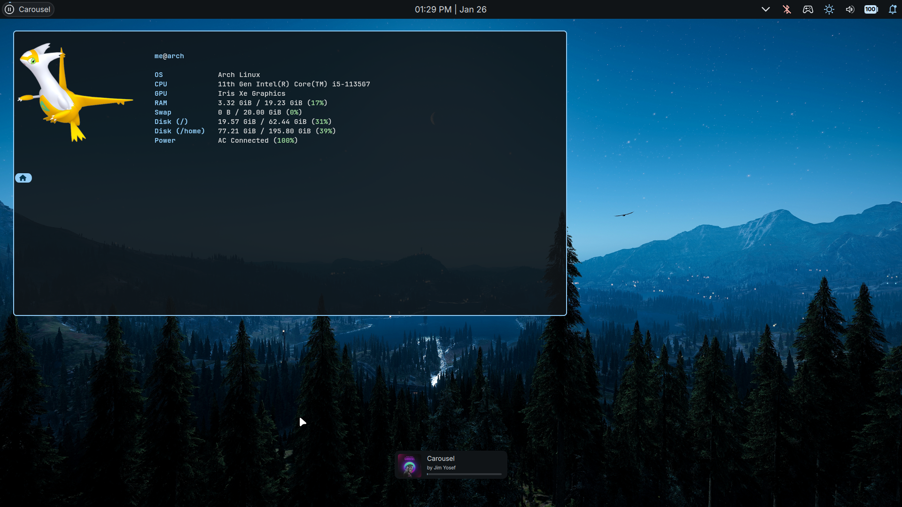

# inlinefun/dotfiles

Dotfiles repo, for use with [chezmoi](https://www.chezmoi.io/)

## Preview:

### Notes:

- for the qml language server, the `.qmlls.ini` file needs to be in the same directory as the `shell.qml` which in this case is the chezmoi's quickshell config dir, creating a `.qmlls.ini` at the target, which would be `~/.config/quickshell/*/.qmlls.ini` would not work in symlink mode.
